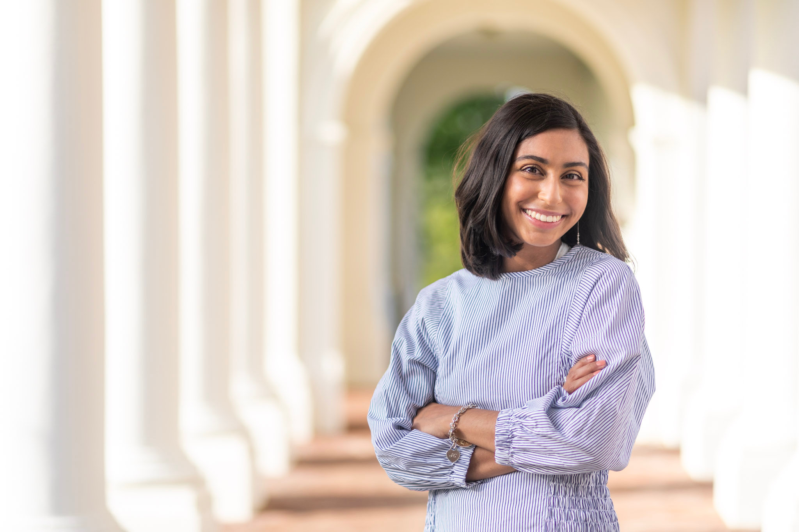

{fig-align="left"}

I am a social psychologist studying friendship, social networks, and conversation. I am an incoming postdoctoral fellow at the [Neukom Institute for Computational Science](https://neukom.dartmouth.edu) at Dartmouth, working with [Dr. Mark Thornton](https://faculty-directory.dartmouth.edu/mark-thornton) in the [SCRAP Lab](https://scraplab.org) and [Dr. Adam Kleinbaum](https://tuck.dartmouth.edu/faculty/faculty-directory/adam-m-kleinbaum) in the Tuck School of Business. I earned my Ph.D, M.A., and B.A. from the University of Virginia, working with [Dr. Adrienne Wood](https://psychology.as.virginia.edu/people/adrienne-wood) in the [Emotion and Behavior Lab](https://emotionbehavior.com).

Across projects, I've asked questions like: do we see ourselves the same way others do? Does that gap in perception matter for connection to a social network? What behaviors reliably happen in a conversation between friends, and how do those patterns differ for strangers? To answer questions like these, I use a combination of naturalistic paradigms, intensive longitudinal methods, and network analysis. My academic work is a commitment to fostering, researching, and teaching about one of the most vital forces in daily life—friendship.

[sareena.chadha\@dartmouth.edu](mailto::sareena.chadha@dartmouth.edu)

[LinkedIn](https://www.linkedin.com/in/sareenachadha/)

[ORCID](https://orcid.org/0000-0002-1301-4554)

[Google Scholar](https://scholar.google.com/citations?user=K9E3m8MAAAAJ&hl=en)
