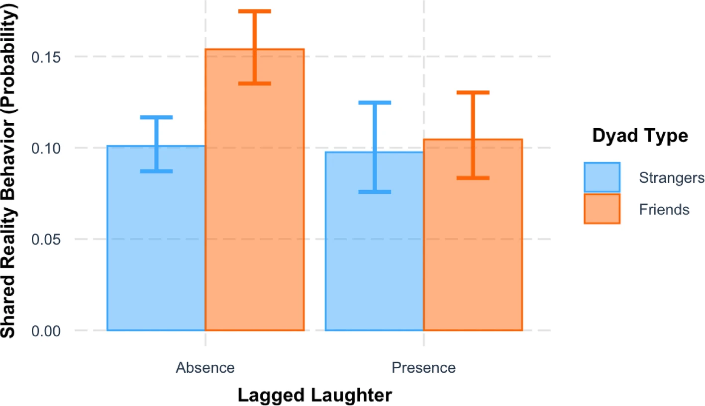
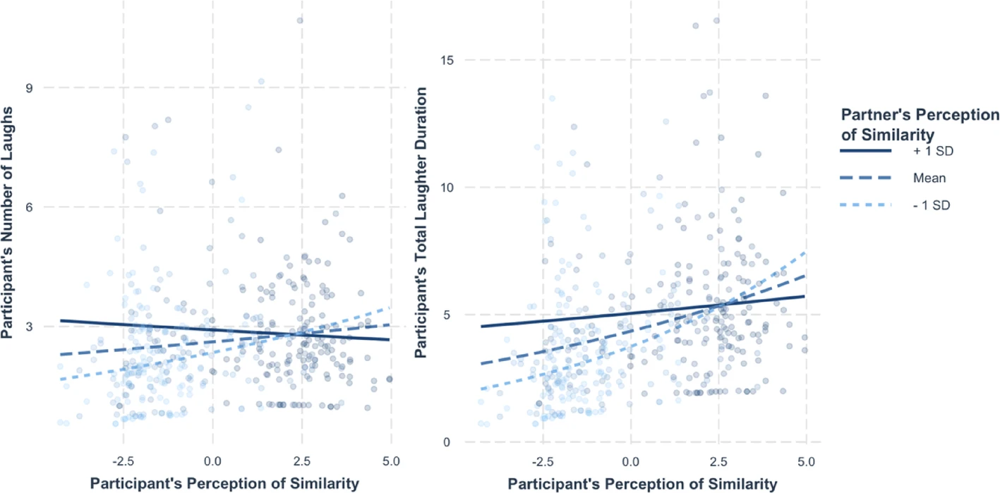
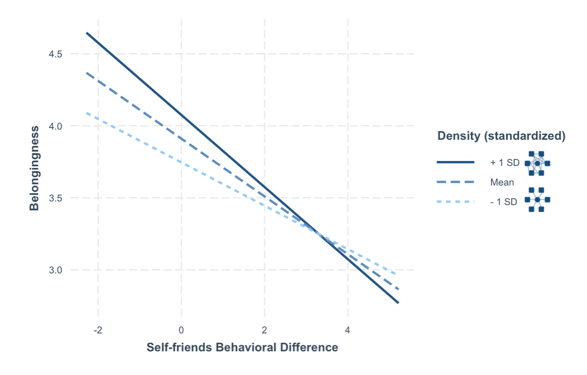
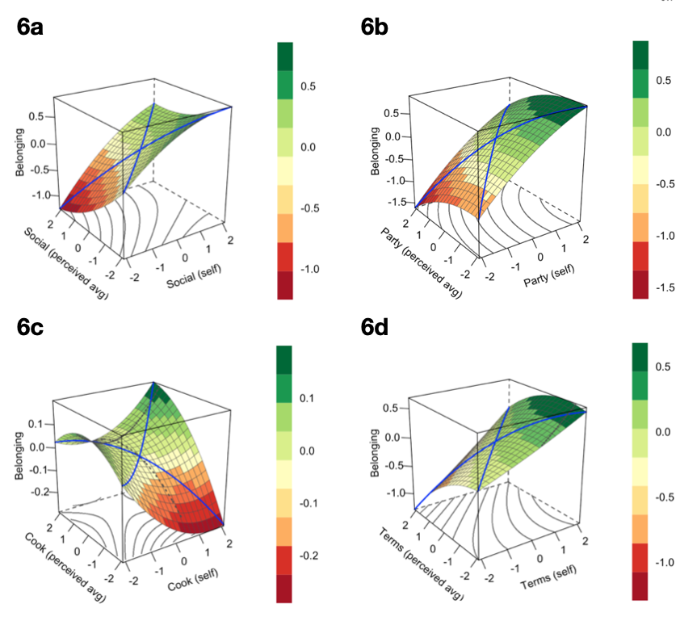
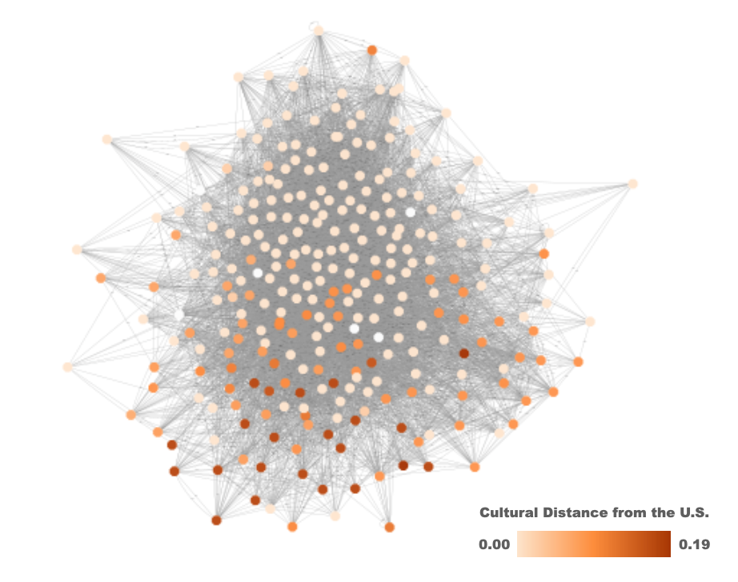
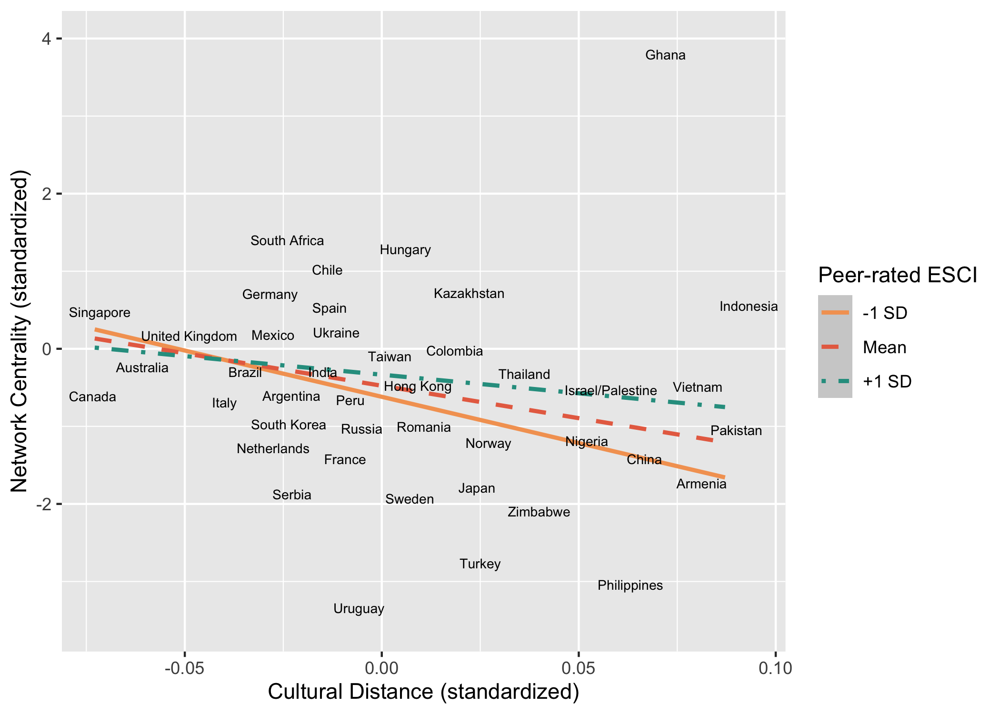

Research on social connection is *especially* crucial in an age of rising loneliness, living alone, and remote work. In some of my projects, I have used computational tools to separately study social networks, behavior over time, and behavior during conversation, with current work seeking to combine these approaches.

# Publications

For an up-to-date list, see my [Google Scholar](https://scholar.google.com/citations?user=K9E3m8MAAAAJ&hl=en) page!

**(\*\* = mentee)**

### Do people laugh in conversation because they feel similar, or feel more similar because they laugh? \[[PDF](website/pdfs/2026%20nonverbal.pdf)\] {[OSF](https://osf.io/u67gy/)}

-   Wood, A., **Chadha, S.,** Liu, C., **\*\*Yuan, Q.,** Davis, A., Elnakouri, A., ... & Boker, S. M. (2026). Laughter indicates perceived similarity among friends and strangers. *Journal of Nonverbal Behavior*, 1-27.

{fig-align="center" width="250"} {fig-align="center" width="250"}

### Is there a tradeoff between spending time with familiar social others and new connections? \[[PDF](website/pdfs/2025%20review.pdf)\]

-   Tsang, S., Barrentine, K., **Chadha, S.**, Oishi, S., & Wood, A. (2025). Social exploration: How and why people seek new connections. *Psychological Review*

### Is belonging better predicted by acting like peers or believing you act like peers? \[[PDF](website/pdfs/2024%20scirep.pdf)\] {[OSF](https://osf.io/wv5r6/overview?view_only=b812a856a3944cc190e556ac0678501d)}

-   **Chadha, S., \*\*Ha, T.,** & Wood, A. (2024). Thinking you're different matters more for belonging than being different. *Scientific Reports*, *14*(1), 7574.

{fig-align="center" width="250"} {fig-align="center" width="250"}

### Do we see ourselves the same way others do? Does that gap in perception matter for connection to a social network? \[[PDF](website/pdfs/2023%20scirep.pdf)\] {[OSF](https://osf.io/a5ctb/overview?view_only=e7de41e9ceba40bfab073ac197efc4d3)}

-   **Chadha, S.,** Kleinbaum, A. M., & Wood, A. (2023). Social networks are shaped by culturally contingent assessments of social competence. *Scientific Reports*, *13*(1), 7974.

{fig-align="center" width="250"} {fig-align="center" width="250"}

------------------------------------------------------------------------

# Working Papers

A few of my current projects!

### How can researchers best select parameters to measure synchrony?

-   Boker, S., Welker, C., Wu, J., & **Chadha, S.** (under review) Parameter Selection for Windowed Cross Correlation to Assess Association between Psychophysiological Timeseries

### Do lonely people have stricter or looser definitions of a friend? Should friends expect the same things from one another?

-   **Chadha, S**., Rodriguez., & Wood, A. (in preparation). Lonely people expect less from their friends.

### When do conversation partners become a more coherent social unit?

-   **Chadha., S.,** Boker, S., Henry, T., & Wood, A. (in preparation) Signaling similarity: how friends and strangers agree, laugh, and nod together

### As someone settles into a new community, how does their social behavior, physical exploration, and experience of the world dynamically shift?

-   **Chadha, S**., Tsang, S., Liu, C., \*\***Li, R.,** Henry, T., Oishi, S., & Wood, A. (in preparation).Dynamics of time spent with social others in a new social environment.

### Can we measure someone's tendency to prefer time with familiar vs. unfamiliar partners?

-   Tsang, S., **Chadha, S**., Oishi, S., & Wood, A. (in preparation).Measuring the Tendency to Socially Explore and Exploit
