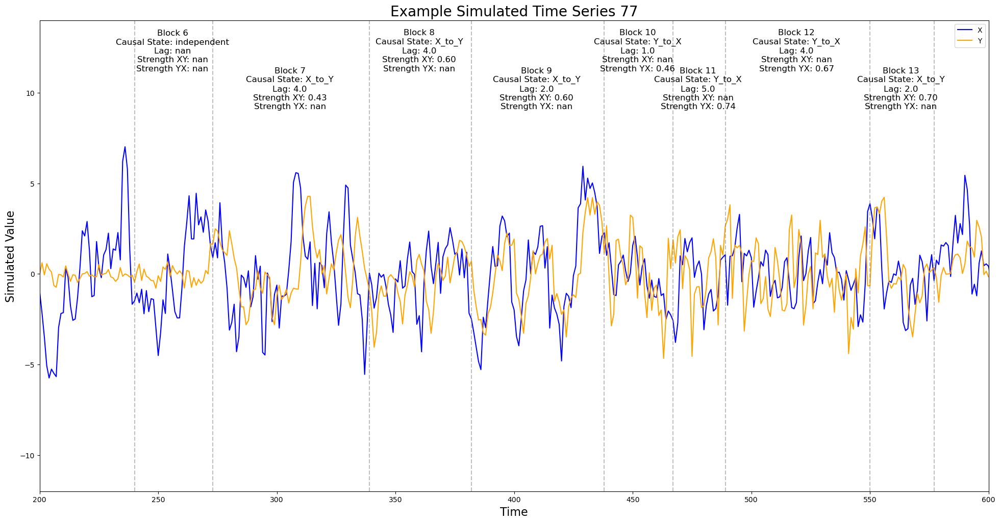
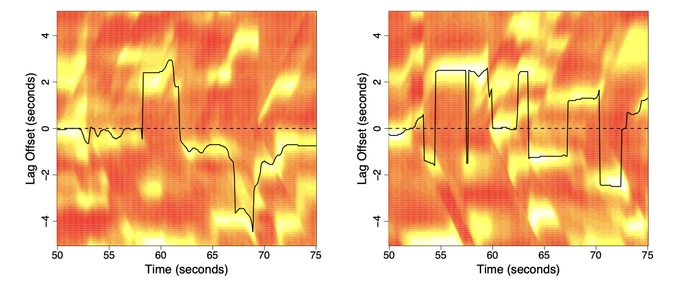
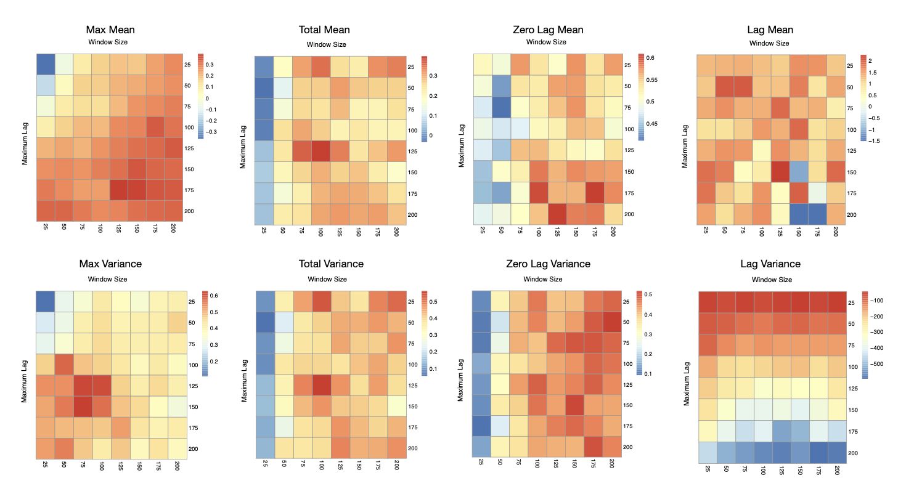

### wcc R package \[[CRAN](https://cran.r-project.org/package=wcc)\]

-   Boker, S., Xu, M., **Chadha, S.,** Welker, C., Wu, J., Deboeck, P. (2026)

-   Estimates association and coordination between two time series that may have shifting features (dyadic nonverbal behavior, physiology, etc.)

    

-   Plots windowed cross correlation

    

-   Assists researchers in selecting optimal parameters for such estimation

    

-   Creates surrogate dyads, to ensure any association via windowed cross correlation is due to true interaction
