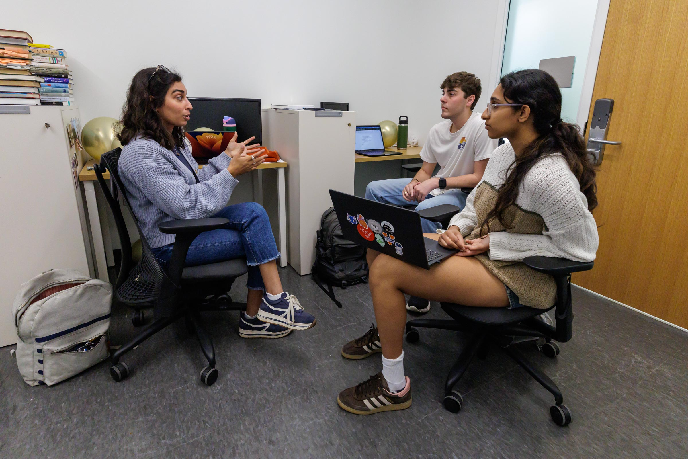

### Instructor of record

Fall 2025

Social connection: From Conversation to Networks

-   Instructor of record for undergraduate seminar course of own design

-   Awarded UVA Distinguished Teaching Fellowship for opportunity to teach

-   Awarded all-university Frank Finger Graduate Fellowship for Teaching (among the highest honors graduate students are eligible for, awarded to one PhD student for outstanding, organized, and stimulating teaching)

-   Evaluations: 4.93/5

### Teaching assistant, lead lab instructor

Spring 2025

Experimental Design & Analysis II (R; graduate-level)

-   Assisted Dr. M. Joey Meyer

-   Evaluations: 4.92/5

Spring 2024

Research Methods & Data Analysis II (R; undergraduate)\

-   Assisted Dr. M. Joey Meyer

-   Evaluations: 4.86/5

Spring 2023

Research Methods & Data Analysis II (R; undergraduate)\

-   Assisted Dr. M. Joey Meyer

-   Evaluations: NA

### Teaching assistant

Spring 2022

Introduction to Cognition\

-   Assisted Dr. Mariana Teles

Fall 2021

Neural Basis of Behavior\

-   Assisted Dr. Erin Clabough
